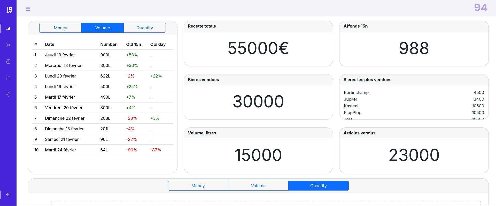
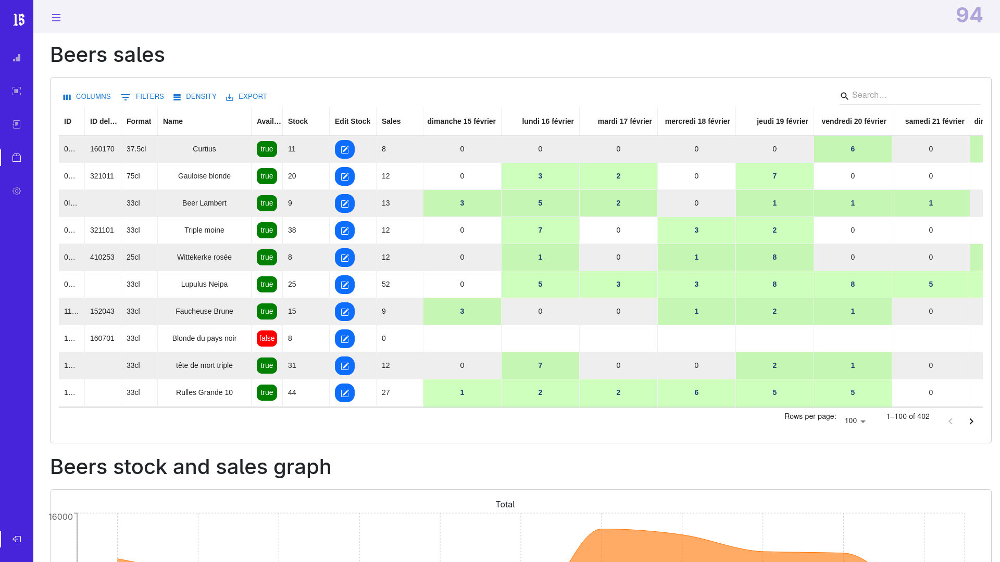
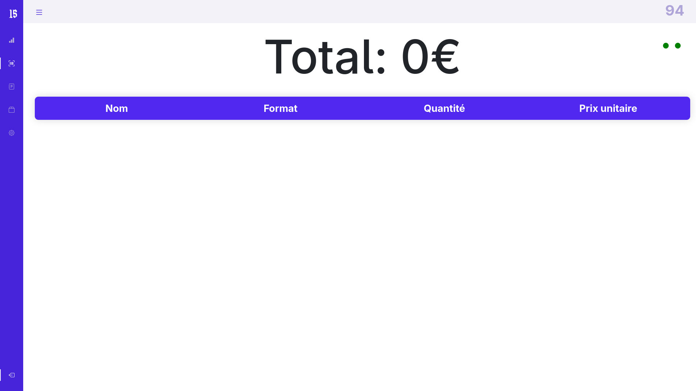

<!--
Tip: Create a repository named exactly like your GitHub username.
GitHub will display this README on your profile.
-->

# Hi, I'm Henri 👋  
**Computer Science (MSc) @ UCLouvain — Network Systems & Cybersecurity**  
🎓 Thesis in progress · **Graduating June 2026** · ✅ **Open to work (available before graduation)**

---

## About me

I’m currently completing my **Master’s degree in Computer Science** at **UCLouvain**, with **only my thesis left** before graduating in **June 2026**.  
I’m actively seeking a **first professional experience** and I’m **available to start before obtaining my diploma**.

My interests span **cybersecurity**, **networking**, and **front-end / full-stack development**. I’m a fast learner, curious by nature, and I enjoy turning ideas into reliable, well-documented systems.

---

## What I do

- 🔐 **Cybersecurity & Networking:** security fundamentals, network services, hardening, analysis mindset  
- 🧩 **Full-stack projects:** building websites, automation tools, inventory & order management systems  
- 🧠 **Soft skills:** team coordination, event organization, partner communication, budgets & priorities  

I enjoy collaborating with others, but I’m also fully comfortable working independently and owning deliverables end-to-end.

---

# 🚀 Some of My Work

## 🌐 quinzaine.org
Personal web project(s) and experimentation platform.  
Focused on clean UI, structured architecture, and iterative product development.
The repo is private for now as it contain sensible data.

🔗 https://quinzaine.org

---

## 🖥️ quinzaine.org, admin pannel (Private Project)

A full-featured **Point of Sale (POS) and inventory management platform**, actively used in a real business environment. The website and Git repository are currently private, as they contain sensitive data.

### Features:
- Point of Sale system for daily operations  
- Real-time inventory tracking  
- Order management & supplier tracking  
- Sales data processing & analytics  
- Stock monitoring dashboards  
- Prediction tools for future orders based on historical trends  
- Customer-facing product availability system  

These tools are used every day and allow customers to be informed about the products we sell and their availability.

📸 *Screenshots available below.*

Example:

---
## 🌐 Student quizz
This is a web app that provides quizzes for students. The goal of the website is to teach students how to party responsibly, with respect for themselves and others. It mainly covers sexual education and safe drinking. I was paid to develop this website.

🔗 https://sante-66741.web.app/

📦 https://github.com/riri-314/quizz-guindaille2.0

---
## 🍻 Mercatos GCL
This web app is a game designed for student associations. Its purpose is to encourage exchanges between associations so students can better discover each other and build connections. It is a fun game created to strengthen bonds between different student associations across various fields of study.

I built this website using React and TypeScript. For the backend, I used Firebase services, including Cloud Functions, Hosting, and Firestore.

🔗 https://mercatogcl.be/

📦 https://github.com/riri-314/mercatosGCL

## Tech stack (comfort zone)

**Security / Systems**
- Networking, Linux, troubleshooting, automation, security mindset

**Development**
- Front-end & full-stack web apps, clean UI, pragmatic architecture

**Workflow**
- Git/GitHub, documentation, iterative delivery

---

JS · TS · Python · Java · C · Rust (learning) · Bash · Oz  
React · HTML/CSS · Flask · Firebase (auth, hosting, storage, functions, ...)  
SQL (PostgreSQL, MySQL)  
AWS · Azure · Git · GitHub

Built and used in real production projects (POS & inventory systems).

## Soft skills

Responsible for organizing a biennial event generating over €100,000 in sales. Managed a team of 5 to 15 people and coordinated with around 20 collaborators and suppliers.

## Open to opportunities

✅ **Open to work** — internships, junior roles, or thesis-adjacent opportunities  
📍 Belgium / EU (remote-friendly)  
🗓️ **Available before June 2026**

If you’re building something in **cybersecurity**, **networking**, or **web platforms**, I’d love to talk.

---

### Let’s connect
<a href="https://www.linkedin.com/" target="_blank">LinkedIn</a> ·
<a href="mailto:your@email.com">Email</a>

